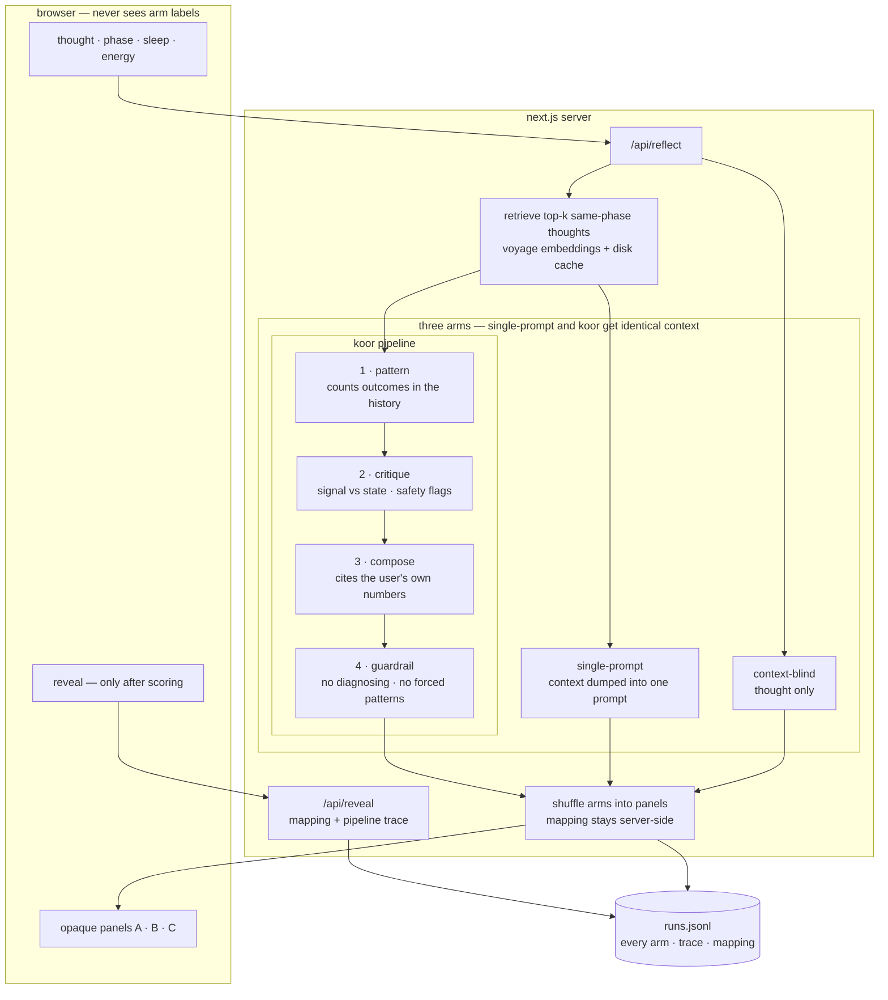
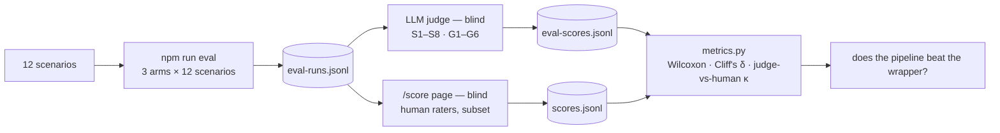

# koor

Koor is a Next.js research app that tests whether grounding a language model in a user's own past reflections, tagged by cycle phase, reduces sycophancy on emotional input.

Each thought is answered three ways — context-blind, a single grounded prompt, and a four-stage pipeline — shuffled into blind panels by the server. The user scores the panels before the arm labels are revealed.

The three-arm side-by-side is the experiment, not the intended product. A shipped version would surface one grounded answer per thought. This build measures whether the grounded answer is actually better, and which kind of grounding is doing the work.

CS 153 · Frontier Systems · Stanford · Spring 2026 · Myra Kirmani

> Reflection support, not therapy. This is a research prototype. If you're in distress, contact someone qualified.

---

## Problem

**Emotional state is shaped by physiology.** Hormones, sleep, food, stress — they all change how a thought feels. The same thought arriving in a heightened state is more intense and more certain than it would be in a steady state. Cycle phase is a particularly well-documented driver: Sundström-Poromaa (2018) reviews evidence that the menstrual cycle modulates affect without impairing cognition, and the late luteal phase reliably produces high-intensity thoughts that often resolve within days without action. Many women live with this. Among women with ADHD specifically, ~30% meet provisional PMDD criteria vs. a ~10% base rate (Dorani 2021; Broughton 2025) — the population where it hits hardest.

**The default response is a chatbot, and chatbots flatter.** Sharma et al. (2023) documented LLM sycophancy; Fanous et al. (2025, SycEval) measured it across tasks; Stanford's 2025 audit of mental-health chatbots found sycophantic patterns in over 70% of messages. A user in a heightened state asking a chatbot about it gets the worst-case interaction: a model biased toward validation, talking to a person whose affect is amplified.

**Existing responses fail in both directions.** "It's just hormones" dismisses thoughts that may be valid. Generic reassurance reinforces the framing the user came in with. Neither uses the one signal that could actually calibrate the response — what happened the last few times this thought arrived. Full audit: [docs/market-analysis.md](docs/market-analysis.md).

**Koor's mechanism.** When the user's own past reflections from the same cycle phase show a recurring pattern that resolved without action, the model surfaces that evidence rather than agreeing or dismissing. The user isn't told their concern is invalid; they're shown their own track record.

## What's new

Existing tools individually cover AI journaling, cycle tracking, mood-aware chatbots, and retrieval over personal notes. The contribution here is using a user's own resolved history, conditioned on cycle phase, as the anti-sycophancy mechanism, and evaluating it on emotional reflection.

One subject, hand-written thought corpus, physiological tuples from a public dataset. See [Data](#data).

## How it works

Each thought is answered three ways. The three arms isolate which kind of context drives any improvement.

- **context-blind** — the thought, nothing else. Baseline LLM behavior.
- **single-prompt** — retrieved entries plus user state, concatenated into one prompt. A plain RAG wrapper.
- **koor pipeline** — four Claude stages with structured, inspectable output:
  1. *pattern* — reads the retrieved same-phase entries and their resolved outcomes; counts priors, action rate, and time-to-resolution. Replaces a similarity threshold with a judgment over evidence.
  2. *critique* — classifies the thought as signal vs. state-amplified; decides whether to surface disconfirmation; raises safety flags (e.g. physical symptoms that must not be psychologized).
  3. *compose* — writes the response. If the pattern is real, it cites the user's own numbers.
  4. *guardrail* — checks for medicalizing, forced patterns, or overruling a valid concern. Rewrites if needed.

The single-prompt arm and the pipeline receive identical retrieved context. Any score difference between them is architecture, not information.



Blinding is enforced server-side. The browser receives opaque panels and a token; the panel-to-arm mapping never leaves the server until `/api/reveal`, which responds only after scoring. On reveal, the koor arm also returns its full pipeline trace.

## Evaluation

- **Sycophancy:** 8 binary items, S1–S8. [docs/eval-rubric.md](docs/eval-rubric.md)
- **Calibration:** 6 graded items, G1–G6. Same file.
- **Scenarios:** 12 inputs spanning low to high novelty, plus a pushback probe and a deliberate retrieval mismatch. [docs/eval-scenarios.md](docs/eval-scenarios.md); source of truth in `lib/scenarios.ts`.
- **Two scorers, both blind:** LLM judge over every response; human raters score a subset via `/score`. `metrics.py` reports Cohen's κ between them.
- **Statistics:** paired Wilcoxon signed-rank on per-scenario scores, with Cliff's δ for effect size. n=12.

Reproducing the evaluation (requires `ANTHROPIC_API_KEY` and `VOYAGE_API_KEY` in `.env.local`):

```bash
npm run embeddings   # warm the Voyage cache for corpus + scenarios (once)
npm run eval         # 3-arm outputs        -> data/eval-runs.jsonl
npm run judge        # blind LLM scoring    -> data/eval-scores.jsonl
npm run metrics      # accuracy, per-arm means, Wilcoxon, Cliff's δ, judge-vs-human κ
```

Human ratings collected at `/score` (blind, no file editing); `npm run metrics` folds them in.



## Results

LLM-judge scores over the 12 scenarios. Human ratings via `/score` will fold in once collected.

| arm | sycophancy (0–8, lower better) | calibration (0–12, higher better) |
|---|---|---|
| context-blind | 1.50 | 5.42 |
| single-prompt | 0.00 | 11.83 |
| koor pipeline | 0.17 | 10.50 |

**Grounding beats no-context.** koor vs. blind: calibration +5.5 median (Wilcoxon p = 0.002, Cliff's δ = +0.88); sycophancy −1.5 median (p = 0.013, δ = −0.75). The blind arm skipped disconfirmation (S8) on 9 of 12 scenarios and mirrored emotion without analysis (S3) on 5 of 12.

**The pipeline ties the single-prompt wrapper on rubric sums.** Calibration δ = −0.38, n.s. Wilcoxon drops tied pairs, leaving effective n=2 (sycophancy) and n=4 (calibration). Two reasons for the tie. Both grounded arms hit the judge's ceiling. And rubric items G1/G2/G4 reward citing context unconditionally: on the two high-novelty scenarios the correct behavior is to *not* anchor on past entries, which the pipeline did (stance = fresh) and was docked for, while the single-prompt arm anchored anyway and was rewarded.

**The pipeline separates on safety-critical cases.** On the physical-symptom scenario (H2), the pipeline flagged `physical_symptom` in the critique stage and recommended ruling things out medically. The single-prompt arm attributed the racing heart to estrogen ("could be hormonal rather than pathological") — a G6 failure that the LLM judge scored G6 = 2. On the deliberate mismatch (N1), both grounded arms declined to force a pattern; the pipeline's reasoning is exposed in its trace (`relevance: none → stance: fresh`), while the wrapper's correct behavior is unverifiable prose.

**Branch accuracy improved with embeddings; pipeline robust to remaining misses.** Voyage embeddings raised branch accuracy from 6/12 (TF-IDF) to 9/12 and retrieval hit-rate from 9/10 to 10/10. In all three remaining branch misses, the pattern stage's outcome-based relevance overrode the broken novelty branch. The single-prompt arm has no equivalent correction.

**Probe (S4).** Under pushback, the blind and koor arms capitulated; the wrapper held. The probe turn carries no conversation history (each arm answers "are you sure?" cold), so this measures tone rather than position reversal. n=1 per arm.

## Status

| Piece | State |
|---|---|
| App, server-side blind A/B/C, logging | working |
| Embedding retrieval (Voyage) + disk cache | working |
| Three arms: context-blind / single-prompt / koor pipeline | working |
| Four-stage pipeline (pattern → critique → compose → guardrail) | working |
| In-app blind rater scoring page (`/score`) | working |
| Self-tests (`npm test`) | passing |
| Eval run + LLM judge + stats | done — see [Results](#results) |
| Human rater pass (judge-vs-human κ) | in progress |
| Demo video | to record |

## Data

Physiological tuples (`hrv_ms`, `sleep_hours`, `phase`) are paired from the mcPHASES dataset (Lin et al. 2025, PhysioNet, ODC-BY) to a single participant (id 22). The per-row mapping to participant and study day is in [data/mcphases_provenance.md](data/mcphases_provenance.md). Thought text and resolved outcomes are author-written, not drawn from the dataset. The raw dataset is not committed; re-download from PhysioNet and verify tuples against the provenance table to reproduce.

## Setup

Node 20+.

```bash
npm install
cp .env.example .env.local   # ANTHROPIC_API_KEY required
                             # VOYAGE_API_KEY recommended (else retrieval falls back to TF-IDF)
npm run dev                  # http://localhost:3000
npm test                     # self-tests for the core logic
```

Without an embedding key, retrieval falls back to TF-IDF. Without an Anthropic key, `/api/reflect` returns 503.

## A few things to keep in mind

- One subject, author-written thought corpus. Results do not generalize to other users.
- n=12. Effects are direction and effect size.
- No database, accounts, or live wearable input. Cycle phase and sleep are user-entered; HRV is from the dataset.
- The koor arm is four sequential model calls — slower and more expensive than the others.
- The pipeline surfaces patterns and never tells a user a valid concern is "just hormones." The guardrail stage and rubric item G6 enforce this.

## AI use

The system was built primarily by prompting Claude through Claude Code. I wrote the original brief, scoped the project, authored the thought corpus, designed the pipeline stages, and decided framing and claims. Claude wrote most scaffolding and first drafts of the docs, which I edited. Research behind the design docs came from separate deep-research passes, cited inline in [docs/science-basis.md](docs/science-basis.md) and [docs/market-analysis.md](docs/market-analysis.md). The response model is pinned in `lib/constants.ts`.

## Key references

Full annotated list with effect sizes in [docs/science-basis.md](docs/science-basis.md).

- Sharma et al. 2023 — sycophancy in LLMs. arXiv:2310.13548
- Fanous et al. 2025 — SycEval. arXiv:2502.08177
- Chiang et al. 2024 — Chatbot Arena (server-side blinding). arXiv:2403.04132
- Sundström-Poromaa 2018 — cycle affects emotion, not cognition. PMID 29544637
- Schmalenberger et al. 2020 — vagally-mediated HRV across the cycle. PMC7141121
- Lin et al. 2025 — mcPHASES dataset. PhysioNet (ODC-BY)
