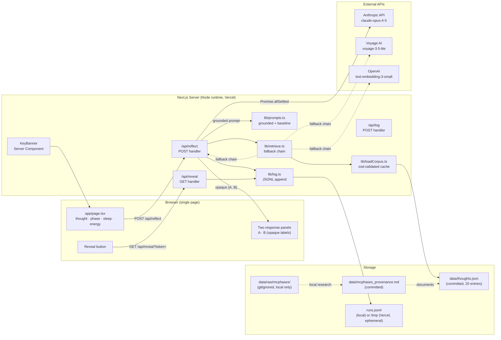
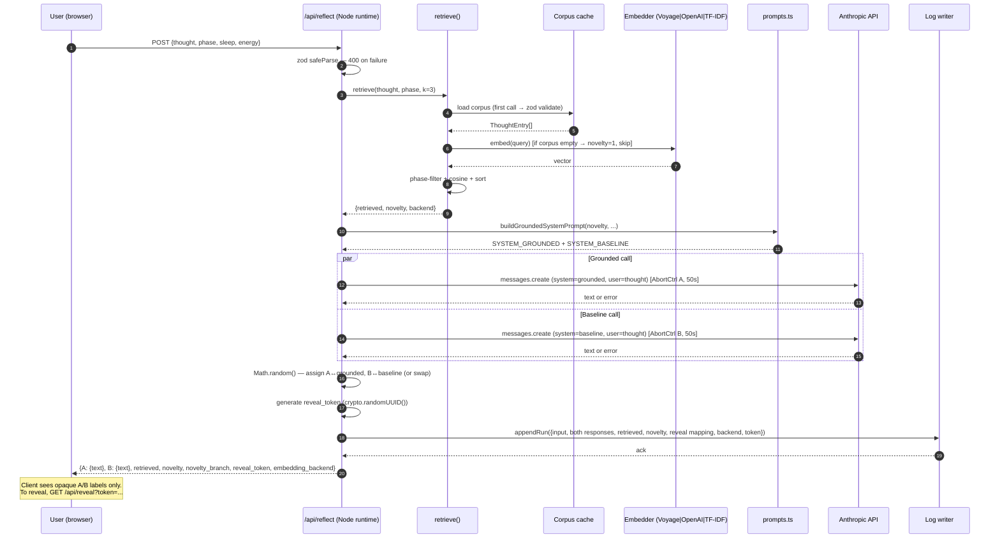
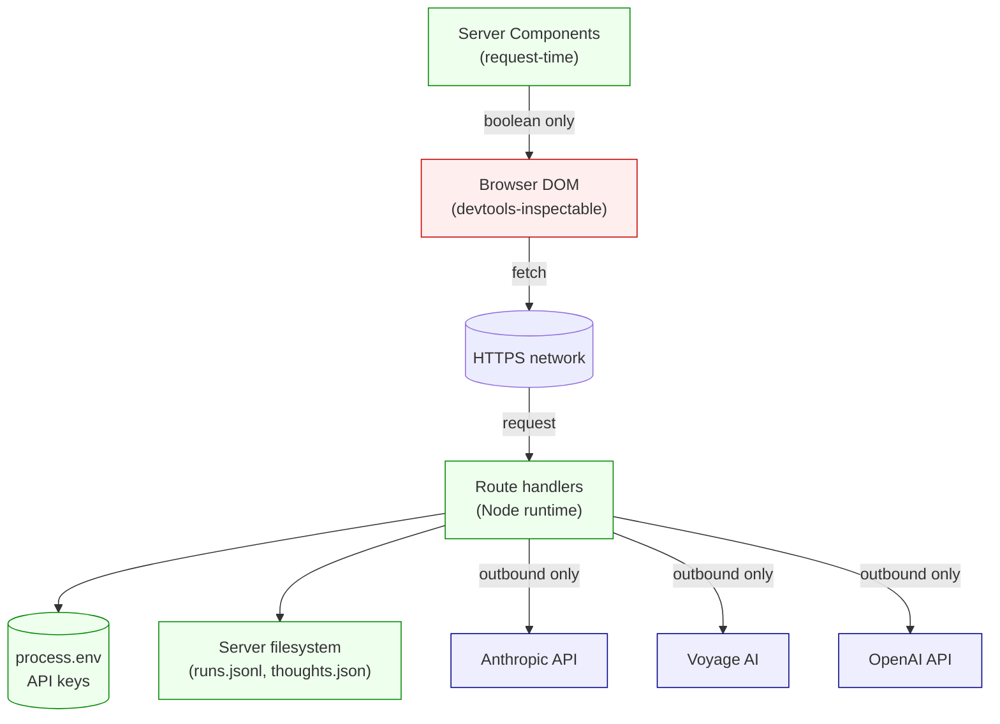
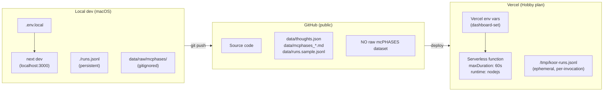

# Koor — System Architecture

**Author:** Myra Kirmani
**Date:** 2026-05-17
**Companion docs:** [PRD](./prd-koor-2026-05-17.md) · [Tech Spec](./tech-spec-koor-2026-05-17.md) · [Science Basis](./science-basis.md) · [Eval Rubric](./eval-rubric.md)
**Scope:** System-level architecture — components, data flow, trust boundaries, deployment, failure modes. The tech spec covers parameter-level decisions; this covers shape.

---

## 1. Architecture in One Diagram

---

## 2. Component Responsibilities

| Component | File(s) | Responsibility | Trust |
|---|---|---|---|
| **KeyBanner (RSC)** | `app/_components/KeyBanner.tsx` | Server-side check of `process.env.*_API_KEY` presence; emits banner state to client as a boolean only. | Server-only |
| **Page UI** | `app/page.tsx` | Input form (thought, phase, sleep, energy); shows two opaque response panels A/B; calls `/api/reflect` and `/api/reveal`. | Untrusted client |
| **Reflect handler** | `app/api/reflect/route.ts` | POST. Validates body (zod), runs retrieval, builds both prompts, fires parallel Claude calls (`Promise.allSettled`), assigns A↔grounded mapping (server-side), writes run record via log writer, returns opaque `{A, B, retrieved, novelty, novelty_branch, reveal_token, embedding_backend}`. | Server-only |
| **Reveal handler** | `app/api/reveal/route.ts` | GET with `reveal_token`. Returns `{A: 'grounded'|'baseline', B: 'grounded'|'baseline'}`. Looks up the token in the run log. | Server-only |
| **Log handler** | `app/api/log/route.ts` | POST. Accepts client-side rater annotations (rubric scores) and appends to the run record by `reveal_token`. | Server-only |
| **Retrieval** | `lib/retrieve.ts` | Phase-filtered top-k cosine over embeddings; novelty = `1 − max(sim)`. Lazy backend choice + cache. | Pure (no env access except via embedders) |
| **Embedders** | `lib/embedders/{voyage,openai,tfidf}.ts` | Fallback chain. Voyage if key set, else OpenAI if key set, else TF-IDF. Each reads its own env var. | Server-only |
| **Corpus loader** | `lib/loadCorpus.ts` | Zod-validates `data/thoughts.json` at first call; caches in memory. | Pure |
| **Prompt builder** | `lib/prompts.ts` | Builds baseline system prompt (constant) and grounded system prompt (3 branches by novelty). | Pure |
| **Log writer** | `lib/log.ts` | `fs.appendFile` to `./runs.jsonl` locally or `/tmp/koor-runs.jsonl` on Vercel; awaited. | Server-only |
| **Constants** | `lib/constants.ts` | MODEL, MAX_TOKENS, TEMPERATURE, NOVELTY thresholds. | Pure |
| **Types** | `lib/types.ts` | Zod schemas + inferred TypeScript types. | Pure |

---

## 3. Request Lifecycle (`/api/reflect`)

**Key invariants:**
1. **Client never sees grounded↔A/B mapping** until it requests `/api/reveal` with the token. The token is the only handle.
2. **One Claude failure is recoverable** — `Promise.allSettled` returns both outcomes; the failed arm emits a structured error in its panel, the other still renders.
3. **Retrieval is cached on first call** — the corpus embedding pass runs once per server process (cold start), not per request.
4. **Novelty drives prompt branching** server-side — the client only sees `novelty_branch: 'low' | 'mid' | 'high'` as metadata; the actual prompt text is never sent to the client.

---

## 4. Trust Boundaries

**Boundary rules:**
- **No `NEXT_PUBLIC_` env vars.** Every API key is server-only. The KeyBanner RSC inspects `process.env` and emits a boolean to the client — never the value.
- **The grounded↔A/B mapping is a server secret** until `/api/reveal` is called. It lives in `runs.jsonl` keyed by `reveal_token`.
- **No client-side LLM calls.** The browser never sees `ANTHROPIC_API_KEY`. All Claude calls originate from the route handler.
- **No user PII collected.** `runs.jsonl` records the thought text + responses; there's no user identity.

---

## 5. Deployment Topology

**Topology notes:**
- **Vercel filesystem is read-only except `/tmp`**, which is ephemeral per invocation. So `runs.jsonl` on Vercel is for live debugging only — not durable. Durable storage is a v2 concern.
- **Branch on `process.env.VERCEL`** in `lib/log.ts` to pick between `./runs.jsonl` (local persistent) and `/tmp/koor-runs.jsonl` (Vercel ephemeral).
- **`data/raw/`** holds the local mcPHASES working copy; gitignored and never deployed.

---

## 6. State Inventory

| State | Where | Lifetime | Reproducibility |
|---|---|---|---|
| `thoughts.json` corpus | repo, committed | persistent | yes — committed JSON |
| Corpus embeddings | server memory | server process lifetime | recomputed on cold start; logged in `runs.jsonl` |
| `runs.jsonl` (local dev) | `./runs.jsonl` | persistent across restarts | yes — gitignored, dev-only |
| `runs.jsonl` (Vercel) | `/tmp/koor-runs.jsonl` | per-invocation | **no** — disclosed in README |
| reveal_token → mapping | `runs.jsonl` record | until log purged | per-`runs.jsonl` lifetime |
| API keys | `.env.local` / Vercel env | server process | n/a (secret) |
| mcPHASES raw | `data/raw/` | local only | re-downloadable from PhysioNet |

**Key implication for the eval:** Tonight's `/api/reflect` runs on Vercel will not persist. Real eval scoring this week happens on **local dev** where `./runs.jsonl` is durable, or on a future v2 with a real store.

---

## 7. Failure Modes — System Level

| # | Failure | Behavior | Mitigation |
|---|---|---|---|
| F1 | One Claude call fails or times out | `Promise.allSettled` → the working arm renders; failed arm shows error marker. Run is still logged with partial data. | ABORT_TIMEOUT_MS = 50s per call; structured error in response payload |
| F2 | Both Claude calls fail | API returns 502 with structured error; UI shows toast | UI shows actionable retry button |
| F3 | Voyage API down | `retrieve.ts` catches and falls through to OpenAI, then TF-IDF. Backend logged in run record. | Fallback chain explicit, logged at cold start (FR-007) |
| F4 | `ANTHROPIC_API_KEY` missing | KeyBanner renders red banner; reflect endpoint returns 503 with "missing key" message | RSC check at render time; documented in `.env.example` |
| F5 | `thoughts.json` malformed | Zod throws on load; server logs schema error and returns 500 on first reflect call. | Zod validation enforced; tested at boot |
| F6 | Empty corpus (`thoughts.json = []`) | `retrieve.ts` returns `novelty = 1.0` and `retrieved = []`. Grounded prompt uses the "high novelty + no past entries" wording. | Handled gracefully — tonight's done-state allows empty corpus |
| F7 | Vercel function timeout (60s) | Both Claude calls aborted; client sees 504. | Per-call AbortController is 50s; total stays under 60. p95 should be ≤ 8s. |
| F8 | DOM leak — order of A/B reveals which is grounded | Mitigated at design level: server randomizes; client never sees label until reveal endpoint is called. | NFR-006 in PRD; verified by inspecting response payload in devtools |
| F9 | Rater identifies grounded by phase-language in response ("luteal phase…") | Documented as known limitation in `docs/eval-rubric.md` §5 | Rater is instructed to score quality, not source-detectability |
| F10 | Runaway tab / autoplay submission | Each call ≈ $0.02 in tokens; 100 submissions ≈ $2 | Note in README "How to run"; consider rate-limit in v2 |

---

## 8. Observability

**For the prototype:**
- Cold-start log line: `[koor] embedding backend: <name>` (FR-007 verification).
- Each `/api/reflect` records the full run to `runs.jsonl`: input, both responses, latencies, retrieved entries, novelty, novelty_branch, embedding_backend, reveal mapping, reveal_token.
- Anthropic SDK errors logged to `console.error` with the call arm tag (`grounded` or `baseline`).

**Deliberately deferred to v2:**
- Distributed tracing (OpenTelemetry) — overkill for N=1 prototype.
- Metrics aggregation (Vercel Analytics or Datadog) — single-developer use.
- Alerting — no SLAs at this stage.

---

## 9. Extension Points (v2)

The architecture is intentionally shaped so the following can be added **without re-architecting**:

| v2 Need | Insertion point | Effort |
|---|---|---|
| **Durable run store** | Replace `lib/log.ts` with a Postgres / Vercel Blob writer; same `appendRun(record)` API | Low |
| **Real HealthKit / Oura ingest** | Add `lib/ingest/healthkit.ts`; replace manual phase/sleep/HRV inputs with live values; `ReflectRequest` schema unchanged | Med (auth + privacy) |
| **Multi-user (auth)** | Add user_id to `ReflectRequest` + corpus partitioning by user | Med — requires auth + schema migration |
| **Whisper voice input** | New `lib/transcribe.ts`; UI swaps textarea for record button; payload still hits `/api/reflect` with text | Low |
| **Streaming responses** | Replace `messages.create` with `messages.stream`; route handler returns SSE | Low |
| **Prompt caching** | Add `cache_control` markers in grounded prompt; toggle in `lib/constants.ts` | Low — once corpus > 5k tokens |
| **Longitudinal A/B with 72h follow-ups** | New `app/api/followup/route.ts` + cron job; same run record format | Med — needs durable store + user identity |

The v1 → v2 path is **substitution at named seams**, not rewrites.

---

## 10. Architectural Decisions (ADR-style summary)

| ADR | Decision | Status | Rationale | Source |
|---|---|---|---|---|
| ADR-01 | Next.js App Router + Node runtime (not Edge) for `/api/reflect` | Accepted | 60s timeout + `fs.appendFile` need Node | Tech spec §1 |
| ADR-02 | `Promise.allSettled` with independent AbortControllers | Accepted | Partial data > no data | Tech spec §2 |
| ADR-03 | `voyage-3.5-lite` primary embedder, OpenAI then TF-IDF fallback | Accepted | MTEB benchmarks + cost; explicit chain auditable | Tech spec §3 |
| ADR-04 | Server owns grounded↔A/B mapping; client gets opaque labels | Accepted | DOM-leak mitigation, PRD NFR-006 | Tech spec §6 |
| ADR-05 | JSONL append via `fs.appendFile` awaited; branch on `VERCEL` | Accepted | Atomicity + Vercel FS constraint | Tech spec §4 |
| ADR-06 | Novelty score branches grounded prompt (low/mid/high) | Accepted | Was metadata-only in original brief — needed a behavioral hook | PRD gap #1 |
| ADR-07 | Pre-registered rubric committed before any output generated | Accepted | Stanford-level scrutiny demands non-cherry-picked eval | PRD gap #4 |
| ADR-08 | No mcPHASES participant-level data in repo; values + provenance regenerated locally from the user's own credentialed download | Accepted | PhysioNet Restricted Health Data DUA 1.5.0 prohibits redistribution | PRD §10 |
| ADR-09 | Skip `/bmad:architecture` formal workflow (this doc is the architecture) | Accepted | Stack already constrained by brief; tech-spec + this doc cover the needed shape | Plan §"BMAD Sequence" |
| ADR-10 | Reflection-not-therapy framing in README + UI footer | Accepted | Stanford HAI 2025 risk literature | Science basis §6 |

---

## 11. What this Architecture Explicitly Does **Not** Do

- **No backend database.** All state lives in the file system + run logs.
- **No real-time event stream.** Each reflection is a single request/response.
- **No user authentication.** Single-user prototype; v2 will need auth + data partitioning.
- **No streaming Claude responses.** Both arms return complete text; revisit if latency requires it.
- **No live HealthKit / Oura ingest.** Phase + sleep + HRV are entered manually for v1; physiological values in the corpus come from mcPHASES retrospective data.
- **No A/B test harness with statistical engine.** Stats are computed externally (Python / R) from `runs.jsonl` exports.

These are not gaps — they're scope decisions documented for transparent v1→v2 planning.
